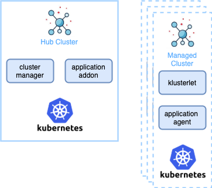

## Open Cluster Management

Welcome! The open-cluster-management.io project is focused on enabling end-to-end visibility and control across your Kubernetes clusters.

Please read the [MISSION.md](MISSION.md) statement for more information.

The open-cluster-management architecture uses a hub - agent model. The hub centralizes control of all the managed clusters. An agent, which we call the klusterlet, resides on each managed cluster to manage registration to the hub and run instructions from the hub.

There are a number of key use cases that are enabled by this project.

### Cluster registration

The API and controllers provide the function for cluster registration and manifests delivery to clusters. Simple core functions connect clusters, such as the klusterlet, to the hub. Other components run on this base. The following repositories describe the API and controllers for registration:

* https://github.com/open-cluster-management/api
* https://github.com/open-cluster-management/registration
* https://github.com/open-cluster-management/work

### Delivery, upgrade, and configuration of applications on Kubernetes clusters

* Centrally create, update, and delete Kubernetes clusters across multiple private and public clouds.
* Automatically deploy applications to specific clusters by subscribing to different workload (resource) channels, such as GitHub, Helm repository, ObjectStore, and resource templates.

The application model defines a Kubernetes-first way of describing the application. Your existing Kubernetes apps or `kustomized` apps can be adapted with the addition of a few new objects: `Channel`, `Subscription`, and `PlacementRule`. Changes made to the app are then easily delivered to managed clusters based on the dynamic placement engine.

The following repositories describe the underlying API and controllers for the app model:

* https://github.com/open-cluster-management/multicloud-operators-subscription
* https://github.com/open-cluster-management/multicloud-operators-placementrule
* https://github.com/open-cluster-management/multicloud-operators-subscription-release
* https://github.com/open-cluster-management/multicloud-operators-channel

There are demonstrations available at https://github.com/open-cluster-management/demo-subscription-gitops .

### Community meetings

The community meets on a bi-weekly cadence on Thursday at 15:30 UTC.

Meeting Agenda and Topics can be found here: https://github.com/open-cluster-management/community/projects/1.
  
  Meeting dial-in details, meeting notes and agendas are announced and published to the [open-cluster-management mailing list on Google Groups](https://groups.google.com/g/open-cluster-management).
